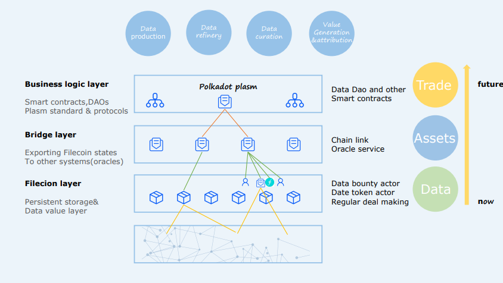
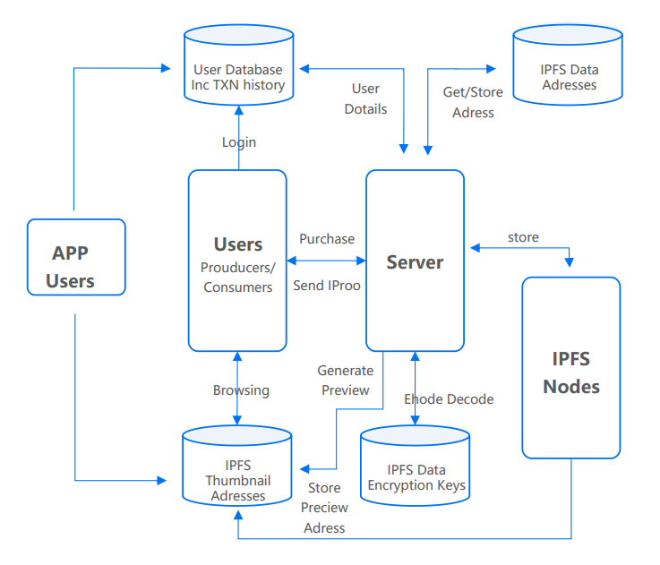
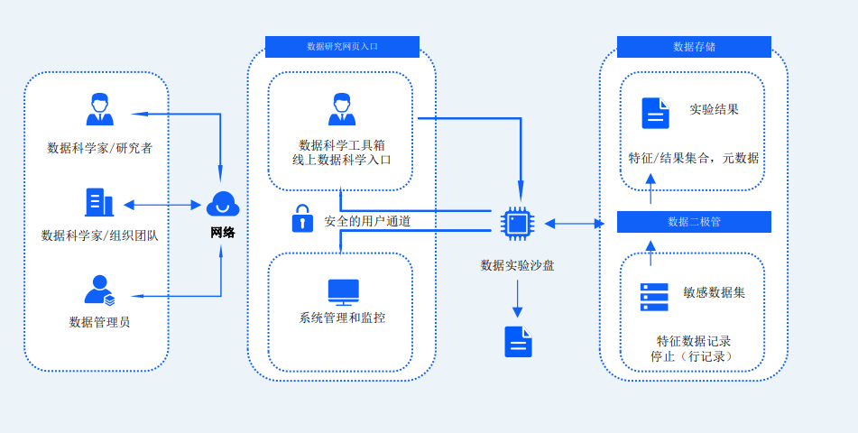
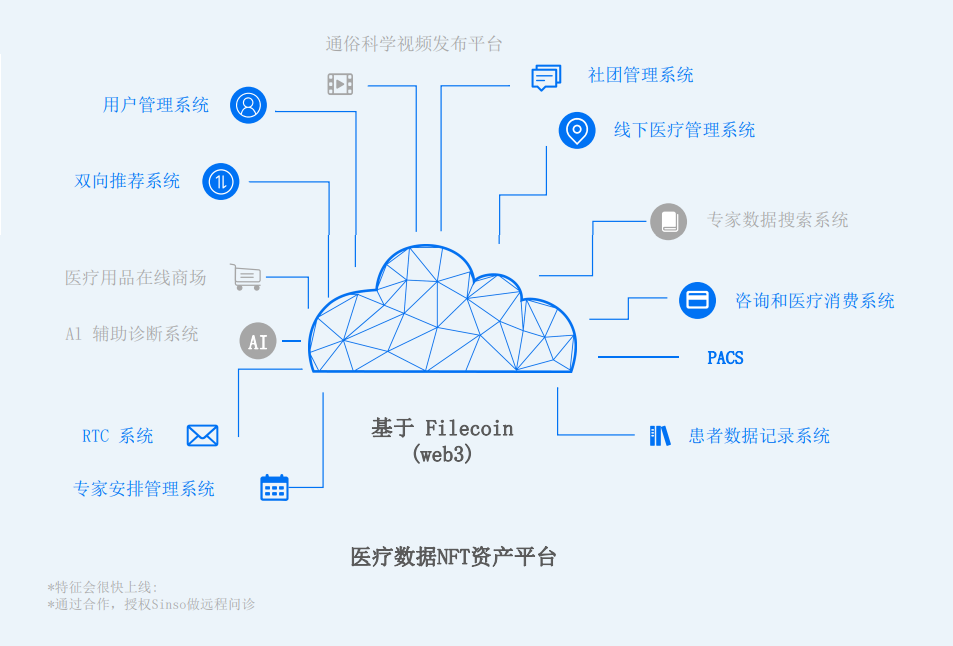

## Technical Framework

In Sinso’s technical architecturem IPFS serves as basic storage system for
the whole project, while filecoin store high value date persistently. Value
of medical data depends on users’ choice, we can say that IPFS prefers
hot data. High value data formed in diagnosis and treatment will be
archived in aficionado Sinso getaway will help with the connection
between oracles and external data. More data management functions,
including data labeling and classification, also privacy calculations pre- processing will be added to this part gradually. Polkadot’s parachain
Plasm will offer support for the top layer.

Plasm, which is currently the only multi-virtual machine interoperable
smart contract platform, is available for Solidity contracts ( and WASM ink!
Of course),so we’ll have strong business flexibility. Besides, there will be
no problem from ERC720 and ERC721.There is no need to deploy
contracts on an independent substrate chain ( because of huge cost), so
that we can improve efficiency greatly and reduce threshold and gas
consumption. Besides compatibility with Ethereum, we will use
components like Optimistic Rollups, ZK Rollups and Plasm to build a Layer
2 comprehensive solution. Our proposal has better compatibility ,lower
transaction costs, higher speed and less technical difficulties. Particularly, WASM can run only on a browser, but also in a non-web environment. It
has strong ability to couple with medical data based on HTML5,either on
Donors Network or gateway. We can also get a part of smart contract
deployment rewards with the help of Plasm’s ecology. We'll make contract
deployment a development to encourage external teams to expand
Sinso’s architecture. Let’s say a development with incentive model. We’ll
release the app on Polkadot’s pioneering network Kusama.

## IPFS Distributed Storage Of Medical Record Data.

**Medical data storage：**

After the data is approved for storage, there will be fragmented and each
fragment gets a address, we keep these address in IPFS Data Addresses
database, and put fragment data in IPFS node server. To browse
contract ,accredited users will get IPFS Data Encryption key, have the
address from IPFS Data Addresses, and then get data from IPFS node
server. Finally they’ll the combinations of data displayed on web side.

**Oracle:**

We’ll try to use Chainlink solution (decentralized oracle), which is highly
integrated with filconin，to realize two-way connection between Filecoin
network and blockchains that support smart contracts like Ethereum and
Plasm. Security reviewed, Sybil-resistant node operators can easily form a
decentralized oracle network and ensure strong running time and anti- modify.

## Smart Contract Management

On blockchain, most of the data are stored on the chain, any changes will
be recorded. Therefore, the storage institution are not able to use uses’ data without their knowledge. Thus we achieve separation of storage
rights and using rights. And distributed storage of individual identity
authentication information avoids the risk of embezzlement and
tampering ,which is possible for centralized storage. Besides ,through
blockchain’s complex authority custody of multiple private keys, the data
use rights are returned to individuals. By requiring user authorization, we
protect privacy. For example, through smart contract technology, we can
set multiple private keys and rules for access to a medical record, whether a doctor ,a nurse or the patient will need permission for the data. Store data on blockchain through IPFS network and Filecon, control data
through smart contracts, use oracle network and external chains to
interact with contract, in this way medical expenses, corresponding
medical data and insurance are all verified, thus achieve “fully automated” medical insurance payment.

