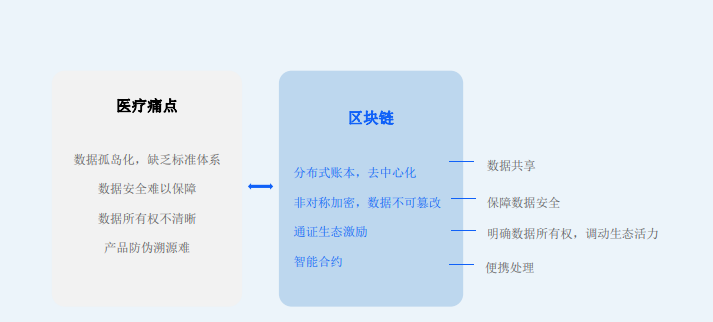
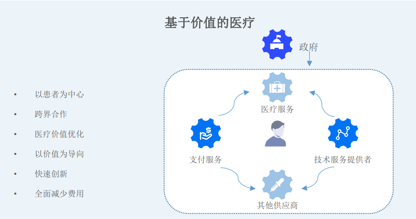

A global project of distributed human health data based on blockchain
technology, aims to establish a new world of revolutionary human
health data management through blockchain decentralized storage
technology and smart contracts.

## Unique NFT For Everyone’s Health Data

NFT, refers to non-fungible token, is indivisible, irreplaceable and unique. Just like human’s genes. There are about 100 trillion cells in each human
body. And DNA in each cell contains a sequence of 3 billion base pairs. Which contains a total of 70,000 to 100,000 genes, 35,000 of them are
functional. These genes are closely related to human life, they determine
our birth, aging, illness, death , appearance , height , skin color, personality, talent, etc. To sum up ,NFT is like a genetic ID card, it’s
unique and only belongs to you. In Sinso system, we create a unique NFT
for each user, by default, it can be used as a biometric ID card. It’s also
allowed to turn a specific data part to NFT, such as a medical image, a
fingerprint, and a 3D bone model. Surgical modeling data also has a
natural connection with NFT as it is relevant to knowledge creation. If we
give doctors ownership of the data, as data producers ,they can get
permanent benefits from data transactions in the future.

Filecoin/IPFS founder Juan said: “ NFTs that are not stored on IPFS are
not really yours” That means ,only NFTs based on IPFS are truly belong to
each
individuals. Therefore, the issuance of our personal NEF bases on IPFS is
practical and necessary. For example ,when we work with car
manufacturers ,our finger vein can be used as our “ Biometric ID card” to
unlock a car, this ID card only belongs to ourselves and shows it’s value. “Heart print “ is not supposed to be snooped and took away. We will not
worry about forgetting heart print/finger print private key ,because once
encrypted, it will be unique and you can carry it for life. Relationship
between NET and stock rights can be flexible ,either correspondence
between stock r ights and personal identity, or invest a health
management and insurance company with part your body data assets. The separation of personal information and AI companies has led to high
transaction/communication cost, pushing up AI pricing , and slowing AI
implementation in AI area. Actually we can become data shareholders of
AI companies, as NET can serve as an ideal trading medium.

As NFT’s main purpose is to confirm and circulate high value assets, not
all medical data are suitable for NFTs, formatted date with high value of
utilization fits better. With extremely low gas fees, Sinso enables users to
make their own biological NFT assets ,this is very pioneering in the
medical field. There is always a lack of individual incentives for medical
data assets , and NFT will definitely active this market. NFT plays an
important role in doctor IP brand and fans economy. Doctors are moving
towards a freelancers’ era, just like artists , they are creators. Every
typical treatment, algorithm, and model are valuable works. Doctors and
fans can build a fan economy bases on NFT, through which patients can
share the benefits once IP grow bigger, and community can sort out the
data. Corporatization turns to DAO architecture, thus NFT will profoundly
change doctor-patient relationship.

## Ensure The Security, Privacy, And Autonomy Of Health Data

The separation of data ownership and data-use right has been a long time
issue, many companies are deliberately avoiding such problems. In order
to get data, data operators in medical industry are restrained and selfish. We are in a very bad situation regarding medical data operation and privacy protection

The <<2017 Data Breach Investigation Report>> released by Verizon
shows that, in terms of data leakage severity, health care area is second
only to the financial industry, accounting for 15%. Regarding the reasons , 62% are related to hacker attacks. Data added to the global electronic
health care record system is growing by 5.5% yearly. Moreover, medical
data contains sensitive patients’ data, making medical area a hard place
for hacker attacks. Average cost of medical data leakage reached to 7.13
million USD in 2020, which is an increase of more than 10% over 2019. Green bone networks analyzed about 2300 online PACS service around
the world from mid-July to early September 2019. According to their
report ,“ these data includes more than 737 million medical radiology
images, and 400 million radio graphic images are accessible ,or can be
downloaded from the internet easily. That means a big part of the data
are not protected ,and there is no access restrictions. Researchers
estimate that the value of leaked data on dark web may exceed 1 billion
USD. And a HHS ( US Department of Health and Human Service ) report
released in April estimated that the average value of medical health data
on dark web is $250, and close to $1000 at most. Again, medical data
comes with high value, and this is in line with File coin's positioning. And
we should put high attention on these data and find long time storage
solutions since they will improve human civilization.

Hospital visits information leakage will not only brings patients safety
threats, legal proceedings and reputations damages., in serious cases, it
could also threat social security. Online data can’t be absolutely secure, or
we can archive data offline. If we need to use them online with a
relatively high level of security. We can make it through matured
cryptography technologies such as verifiable computing, secure
multilateral computing, zero-knowledge proof and homomorphic
encryption. These components will be integrated in the Sinso Gateway, and data will be pre-processed in the collecting step. Not all scenes
require a high-security environment, we need to process them
hierarchically.

<!-- img/bans.jpg -->

As the core production factor of the new era, medical data is
unprocessed and lacks protection of original data. It is difficult to
generate value due to the portability and ease of duplication of data. The CID of the file we store on filecoin is controlled by a smart
contract, so that with the help of Polkadot, the security of the system
is maintained and the gas consumption of running the contract is
reduced. In order to be able to manipulate these data flexibly and
maintain high security and privacy, we will deploy contracts on the
Plasm Network Polkadot platform. We can give the data strong
programmability and autonomy. Suppose we can sell our data to an
insurance company through an AI data agent. This process is the
autonomy of the data, and there will be no privacy violations during
the transaction.

## A Decentralized Health Data Trading Center — Peer To Peer Transactions

blockchain's core value for medical data storage and sharing is to realize nontampering and traceability, and ensure data safety. It is an upgraded protection mechanism based on traditional information storage and access.

Compared with traditional centralized storage methods, distributed data
storage supported by blockchain technology reduces risks and increase
security. In terms of management , it avoids monopoly of centralized
storage institutions on medical data, as well as black box operation.

Medical data is very sensitive, there are strict restrictions on this in laws
and regulations, such as the privacy protection regulations of HIPPA . According to a Gaplow poll in the US, 66% of respondents are against
data availability to data diggers. The biggest concern is privacy. Medical
data are under law protection no matter in China, US, Africa or European
Union, patients has absolutely right to deal with their own data and no
one can infringe their rights on this. It will be difficult for any centralized
organization to trade medical data continuously, or else they are easy to
get public criticism.

However, using “one size fits all” approach to prohibit data digging thus
protect data does not fit our social changes. Today ,our demand is to
circulate the data, and make a balance between privacy protection and
medical data circulation. But a completely decentralized system should be
doing it, instead of a centralized organization.

It’s difficult to identity and prevent data digging organizations from doing
evil, and relying on the law to punish them is not helpful. Sinso has the
mission to build up a “decentralized trading market for medical data”, it
will be an open source ,machine driven, highly secure net work managed
by community. This key function will be supported by Sinso donors
network. We know that medical data is of great value. For example, 1000
MB of medical data may contains a high precision CT tomography of a
body part, and user pay $500 for a diagnosis ( US market price ). 1PB
carries 10,000 copies of such records, that users need to pay up to 500
million US dollars to deposit such data.

These are just basic data, the value will increase if we classify and
process them. Filecoin main net has more than 3EB of data at present. If
we store all such media date in Filecoin, it’s total value should reach 1.5
trillion USD at least. In order to increase the public’s interest in medical
data assets. We provide a NFT medical data assets issuance platform, together with assistant tools on it, Web3D and DICOM3 browsers are two
of them that allow users to select more valuable data for NFT issuance.

Users may found it unfamiliar at the first time, we will provide guidance
tools to help them. These date assets can be issued in a way of
compatible ERC721 bases on Plasma Network, or we can split and trade
NFT assets based on ERC720.Different kinds of transactions can be
applied to various scenes. For example, we can select data for a certain
period of time, issue corresponding NFTs after automated data
desensitization, and pledge these NFTs to big data or AI companies to
share the profits and offer data model training services for them. It's the
same logic with staking. The key is that filecoin data assets are traceable, and NFT programmability will become powerful and flexible.

Data transactions will be autonomous and no one can interfere. In
thousands of years before, medical date was in a feudal era and there was
not democracy involved. NFT will make the first step. Human intervention
is horrible, as long as we handover our job to machines and make
automated transactions ,trust and cooperation will be enhanced.

High value data storage will make substantial benefits, and File coin will
continuously implement some rewarding plans at the early stage,
including Filecoin Plus Plan. Gas cost for data storage is not our concerns , and we can reply the system with rewards and help the transaction
system to improve rapidly. We'll encourage large amount of miners to join
us at the early stage.

Transactions generates value. How to achieve Pareto optimality ? Only
decentralized ,peer to peer transactions can achieve this mission. Through
sufficient market competition, the market for medical data NFT will grow
bigger, we can even combine it with virtual games. As long as we use our
imagination, there will be various application scenarios for NFT. Doctors
personal influence can be turned to NFT assets too if they have reputation
and pledge value. NFT issuance attached practical value to it and will
drive fan economy for freelance works, this also goes for artists. Except
that being traceable and verifiable are more important here. The value in
it is obvious, because most assets are on chain in Sinso system. Transactions are only helpful on encouraging participants to find suitable
NFT niche market , they can also promote formatting and updating of
data.

Sinso donors network is the most distinctive part of the entire Sinso
ecosystem. We always believe that by providing a trading environment, doctors and patients will work well together , also it will reduce medical
costs greatly. Cost will be reduced because large scale overall training of
AI data will pay back for human health. We’ll get systemic profit from it. In the next 10 years , medical artificial intelligence will replace 80% of
human labor force, AI can do good enough.

## Establish A Unified Standard For Global Human Health Data

In theory, multiple backups of blockchain date is less efficient to maintain
than single, centralized database. However, current human medical data
is fragmented. Many parties are already maintaining database backups
containing the same information. But custodian neither value user right, nor cooperate, not to mention protect users’ privacy. In multiple database
backups, same transaction’s date contradicts each other, lead to costly , time-consuming reconciliation procedures. Distributed databases across
organizations can greatly reduce manual reconciliation, thus save costs. Besides , blockchain enables organizations gain common capabilities and
avoid work duplication.

The key value of medical data exchanging and sharing in multiple medical
institutions and regional platforms is to ensure data accuracy and
completeness. With blockchain technology, data producers and users will
jointly maintain a data ledger through consensus mechanism, each data
changes will be recorded , this ensure data accuracy efficiently. There is
no need to produce fragmented medical data repeatedly ,we should build
a unified database that is unique and accessible worldwide at any time.

Today, medical information is kept in the medical field ,and patients’ self- monitoring data generated outside of the hospital is not included. At
present , these data are either recorded in fragments on papers , or in
various health management APPs ,some are stored in smart hardware
devices. We are not able to do “deep phenotypic analysis” on these
scattered data

The data standard Sinso will follow is based on DICOM 3.0, which is
simple and mature. This communication standard issued by American
Radiological Association in 1986 has become a global medical image
communication and storage standard. Sinso will launch the market based
on this standard and make a largest link worldwide. Medical imaging data
is intuitive for diagnosis and rehabilitation, we can get into the core
medical market at initial stage based on research and algorithm
precipitation in DICOM .

Instead of being separated from medical industry, Sinso
will transform the industry into a blockchain ecosystem. We can think of personal medical data and its life as a
“entropy increase model, and delaying the increase
requires external energy. As time goes on, it become
disordered and chaotic, and finally reach the maximum
entropy increase (death). How to maintain “entropy
reduction” to keep data alive? Sinso donors is the key. We
need strong external incentive to strengthen “entropy
reduction”. The standard of human medical data is not
designated by any authoritative organization, but formed
during free bottom-to-top competition. The process is like
language formation, we accept all kinds of data formats
and templates, just as various dialects in languages. In
order to improve efficiency, there will be better ways to
express data. These all come from “emergence”. Data
standardization has been a pseudo-proposition for a long
time, especially in life sciences area, it will meet great
challenges.

Our health state is not just about medical records or pulse data, we use
mature FHIR standard for communication between conventional medical
systems .But we pay more attention to the Extensions part, because in- depth phenotypic analysis of medical treatment ,the most challenging
and valuable part. We need to make a huge data set with all kinds of
external data. This is the magnificent vision of Sinso, we’ll building a
Web 3.0 soil before we start to achieve “ a global unified human health
data”. Web 3.0 is like adding data to every inch of the land covered by
value network, and each data will have a closely “consensus” with other
data, and has the potential for self-growth. Assuming that we connect 7
billion people’s medical data around the world in a orderly manner, that
would require deep connections with certain rules. Sinso donors network
and Sinso DAC will provide a basic framework to the “emergence”.
