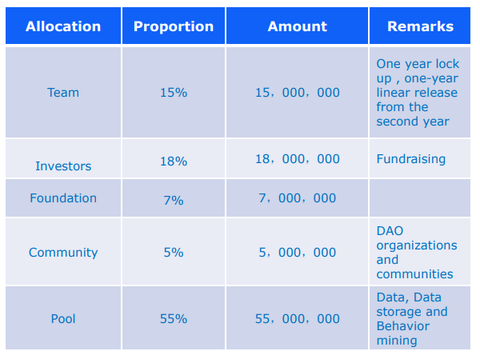
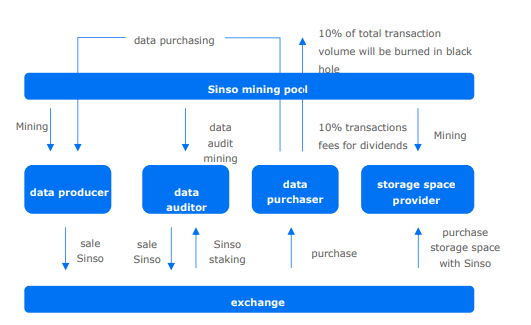

## Issuance Rules

Token name: SINSO

Total Amount: one hundred million

Token types: Parachain Plasm based on Polkadot

## Sinso Deflation Mechanism

- Data producer--obtains SINSO through date upload, sharing, processing
  etc
- Data reviewer--purchasing SINSO on exchange and pledge a certain
  amount of them to get qualification for node reviewing, and get SINSO
  from valid data review.
- Data purchaser-- Data demander needs to pay SINSO TOKEN in trading
  market, to data producers ,or in data sharing pools. 10% of transaction
  fees will be burned in this process and given to the storage space
  providers as dividends.
- Data storage space providers need to burn a specified amount of SINSO
  to purchase storage space, the space will be smaller while more data are
  coming in .Space provider can get generous SINSO rewards through data
  storage and transactions. In addition, in the open smart contract
  framework, there will be a reward mechanism combined with smart
  contract deployment.
