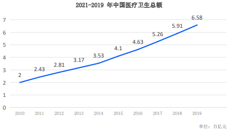

# Background

## Huge Medical Expenditure For Every Country

Medical cost have been surging in both China and US in ten years.

The chart below shows China’s medical cost in recent decade.

Per capita health care expenditure for US has reached 11 thousand USD, up from 550 USD in 1975. US researchers indicate that this figure will
exceed median of family income by 2037.Many people can’t afford their
medical cost, regardless the emerging and development of high
technology and medical technology. Recently, the proportion of medical
expenditure carried by individuals in China has reached more than 50%, and in many areas that don’t have sufficient medical insurance funds,
individuals carry 70% of medical cost.

In America, there is a big gap between rich and poor in health
care .Low-income citizens usually get less medical care opportunities
compared to the middle class and rich. The Covid-19 epidemic has
increased this gap. According to researches from American Insurance
Industry Associations median medical cost for hospitalized covid-19
patients ranges from $30,000 to $60,000 (2000,000 to 400.000
yuan ).This means likely bankruptcy for those who got insufficient or
none medical insurance. In China, the medical gap is not that big. Medical care services are active with the government’s intervention. However, there is great pressure on payment of the medical insurance
funds as individuals are paying more and more yearly . In
underdeveloped Africa areas, health care equality is out of the question
due to medical resources shortage ,uneven distribution and huge rich- poor gap.

## Rising Amount Of Medical Data

Data are generated in the medical process. According to Chinese laws
and related regulations, medical institutions must keep patients’data
for 30 years ,and Clinical data for 15 years. Moreover, China has not yet
solved the date fragmentation and data silos problem, neither has US. As we all know, medical diagnosis and treatment are closely related to
our health data and medical records.

If we can use the data reasonably, we can greatly improve our health
and reduce our overall medical expenditure. Since there is no conversion
from data to data assets , we are not able to process a deep phenotypic
analysis on the data, thus the understanding on our health is always
fragmented and superficial. We always focus on data offered by medical
institutions and believe that’s all we can have. But those data are far
from enough in individual analysis. We need data that combines depth,
length, and breadth. We have to open up a new land for deep phenotypic
analysis. “Consumers are not just data producers, they should own their
own data and get more, thus be responsible for their health.” By the way,
individual medical data amount are rising from a few hundreds MB to
hundreds of TB, and it may reach to PB level in the futures. It’s hard for
institutions ( medical institutions and relevant national health
institutions ) to keep and manage all the data. Not only that the custody
cost is high, also current system makes it difficult to stimulate the
custodians.

## blockchain technology builds doctor-patient trust

We can see great progress in medical technology in recent years .It’s
easy to get a advanced DR or MR machine for remote villages in China. And remote diagnosis platform solves the problem of uneven distribution
of high quality doctors. But we’ll find that we are spending less time
communicating with doctors.

The first consultation took 60 minutes in 1975 in US, now it has reduced
to 12 minutes. Medical technology development failed to build tight trust
between patients and doctors. Moreover, lack of communication between
the two sides are closely relevant to misdiagnosis, superficial contact
with patients makes it worse and brings unnecessary inspections as well
as ineffective treatments. Medical practitioners always pay attention to
quantity to get huge economic return, this forms a strange circle. Actually 30% to 50% CT scans are unnecessary. We need to bring in a
new concept “less is more ”.

All data is expected to be effective and accurate, not unproductive waste. We are looking forward to see Sins to change and improve this situation. Hospitals and doctors may exaggerated the benefits of diagnosis and
treatment due to cognitive biases. But we need to reflect, is the medical
industry the bigger the better ? There is no way to supervise, incentivize
punitions' mission is to build a “healthier and better "era for mankind. We are expecting to “lead mankind to a democratic medical care
era ”.We need to establish fair, transparent medical health infrastructures
on the premise that individuals own their data. Rise of machines and
artificial intelligence should come with better humanization, so that
doctors have more time to accompany and empathize patients .This
defines real high quality medical care.

The biggest value of blockchain technology is to deal with the trust issue. Many technologies that combine centralized databases and cryptography
have been moved to medical field. But it is not the key issue for
blockchain. This makes it difficult for ordinary people to understand the
core of blockchain medical care. The main task of Sinso is to build up a
new land for doctor-patient trust. The first step is to initiate a “personal
health data management revolution”
